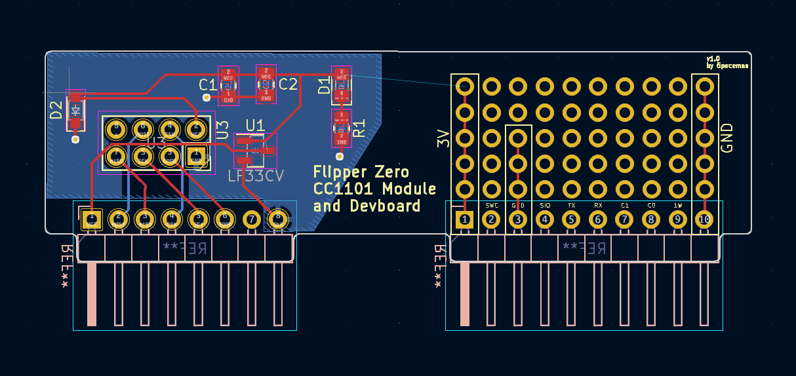

# Flipper Zero External CC1101 PCB

This is a simple design for a PCB to connect to a Flipper Zero to add an external CC1101 module with a better antenna. It includes simple circuit protection for the CC1101 module as well as pins on the right hand side for further development. 

Here is the current PCB design:

Here is the current schematic design: 

KiCad files can be found in CC101ExtBoard folder 