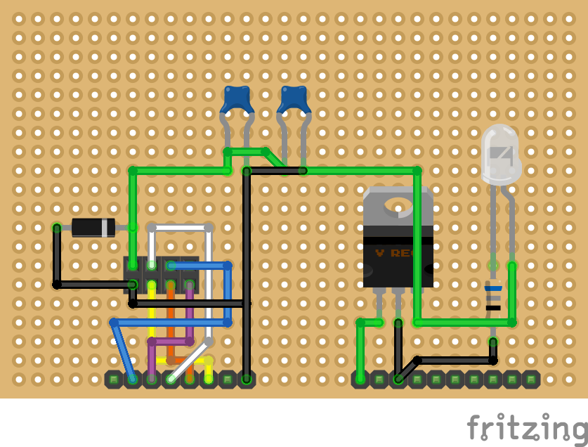
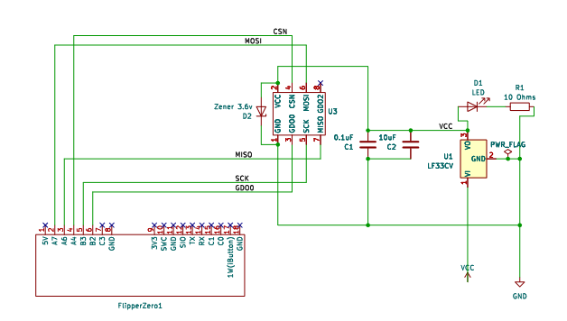

# Flipper Zero External CC1101 Protoboard

This is a simple design for a protoboard to connect to a Flipper Zero to add an external CC1101 module with a better antenna. It includes simple circuit protection for the CC1101 module. 

Here is the current protoboard design:

Here is the current schematic design: 

